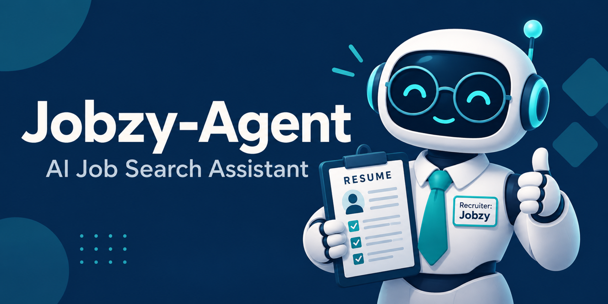

# Jobzy-Agent



Jobzy-Agent is a human-in-the-loop AI career assistant that turns job postings into structured, explainable application recommendations. Its goal is to evaluate qualification fit, prioritize credible opportunities, tailor resumes using verified experience only, and prepare each result for user approval.

> **Status:** Active MVP development. The manual job-intake and AI extraction pipeline works locally. Google Drive authentication, master-resume retrieval, and PDF text extraction have also been tested successfully. Qualification scoring and resume tailoring are the next capabilities in development.

## Table of Contents

- [Why This Project Exists](#why-this-project-exists)
- [Current MVP](#current-mvp)
- [Planned MVP Outcome](#planned-mvp-outcome)
- [Architecture](#architecture)
- [Agent Design](#agent-design)
- [Data and Auditability](#data-and-auditability)
- [Technology Stack](#technology-stack)
- [Repository Structure](#repository-structure)
- [Documentation](#documentation)
- [Roadmap](#roadmap)
- [Security and Responsible AI](#security-and-responsible-ai)

## Why This Project Exists

Job searching often requires repeating the same time-consuming work: reading postings, checking qualifications, researching companies, deciding which roles deserve attention, and tailoring a resume without overstating experience.

Jobzy-Agent is designed to create a consistent workflow that:

- Accepts opportunities from a manual form initially, with Gmail intake planned
- Extracts and normalizes job information
- Preserves the posting date so freshness can affect prioritization
- Compares requirements with a verified master resume
- Explains strengths, gaps, uncertainty, and risk signals
- Assesses posting legitimacy using stored evidence rather than unsupported conclusions
- Produces job-specific resume drafts without fabricating experience
- Requires human approval before consequential actions
- Retains versioned records for auditing and future analysis

## Current MVP

### Working and committed

The workflow currently stored in this repository performs:

```text
Manual job-submission form
        ↓
Normalize submitted fields
        ↓
Save the company, job, source URL, and posting date to PostgreSQL
        ↓
Use an AI model to extract structured job requirements
        ↓
Parse the model response into reusable JSON
```

The PostgreSQL foundation currently supports:

- Users and companies
- Jobs and job sources
- Job-posting dates and freshness queries
- Master resumes and versioned resume records
- Versioned job evaluations
- Verification sources and evidence
- Migration history

### Working locally and awaiting repository export

The current n8n development workflow also performs:

```text
Parsed job requirements
        ↓
Authenticate with Google Drive using OAuth 2.0
        ↓
Download the verified master-resume PDF
        ↓
Extract readable resume text
        ↓
Evaluate job fit (in development)
```

Google Drive authentication, master-resume retrieval, and PDF text extraction have been tested successfully. OAuth secrets, API keys, resumes, and local workflow credentials are not stored in this repository.

## Planned MVP Outcome

The first complete MVP will allow a user to:

1. Submit a job description through a simple form.
2. Receive a structured qualification and legitimacy assessment.
3. See strengths, gaps, hard requirements, missing information, and confidence.
4. Prioritize opportunities using preferences, qualification fit, and posting freshness.
5. Generate a tailored Microsoft Word resume using verified experience only.
6. Review the job description, evaluation evidence, and tailored resume before taking action.
7. Find the job, evaluation, resume version, and decision in PostgreSQL.

Automatic application submission is not part of the MVP.

## Architecture

```text
Job Sources
(Manual Form, Gmail, Future Sources)
                 │
                 ▼
         Job Intake Layer
                 │
                 ▼
        n8n Orchestration
          ┌──────┴──────┐
          ▼             ▼
     PostgreSQL      AI Services
          └──────┬──────┘
                 ▼
         Resume Workflow
                 │
                 ▼
           Google Drive
                 │
                 ▼
           User Approval
```

The architecture separates workflow orchestration, AI reasoning, structured data, document storage, and human approval. Providers are intended to remain replaceable so the system can evolve without redesigning the entire application.

## Agent Design

Jobzy-Agent is designed as a coordinated multi-agent system:

| Agent | Responsibility |
|---|---|
| AI Agent Orchestrator | Routes work, manages workflow state, and enforces approval policies |
| Recruiter Agent | Evaluates job fit, requirements, legitimacy, risk, and recommendation |
| Resume Writer Agent | Tailors verified resume content and maintains version history |
| Application Manager Agent | Tracks application status and important communications |
| Company Research Agent | Collects company information and supporting evidence |
| Career Intelligence Agent | Analyzes job-search outcomes and recommends improvements |
| Preference Learning Agent | Suggests transparent preference updates in a future release |

The AI components must distinguish verified facts from assumptions, record uncertainty, and avoid treating missing information as proof of fraud.

## Data and Auditability

PostgreSQL is the system of record. The relational model is designed to preserve history instead of overwriting important decisions.

Key design choices include:

- Primary and foreign keys for referential integrity
- Constraints for controlled status and score values
- Indexes for common lookup and prioritization queries
- Immutable evaluation history
- Parent-child relationships between resume versions
- Individual evidence records with source, confidence, and score effect
- Numbered SQL migrations that make schema changes repeatable and reviewable

Six database migrations currently establish the foundation, migration tracking, job intake, posting dates, resume versions, and evaluation evidence.

## Technology Stack

### In use

| Purpose | Technology |
|---|---|
| Repository and version control | GitHub and Git |
| Workflow orchestration | n8n |
| Relational database | PostgreSQL 17 |
| Local services | Docker Desktop and Docker Compose |
| Database administration | DBeaver Community |
| AI inference | OpenAI API |
| Master-resume storage | Google Drive |
| Google authorization | OAuth 2.0 |
| Development environment | Visual Studio Code |

### Planned for later MVP stages

| Purpose | Technology |
|---|---|
| Resume document generation | Python and `python-docx` |
| Database migrations after the SQL-learning phase | Alembic |
| Automated testing | pytest |
| Code quality and type checking | Ruff and mypy |
| Continuous integration | GitHub Actions |
| Email intake and notifications | Gmail API through n8n |

## Repository Structure

```text
Jobzy-agent/
├── README.md
├── compose.yaml
├── database/
│   ├── README.md
│   └── migrations/
│       ├── 001_foundation.sql
│       ├── 002_migration_tracking.sql
│       ├── 003_jobs.sql
│       ├── 004_job_posting_dates.sql
│       ├── 005_resume_versions.sql
│       └── 006_job_evaluations.sql
├── docs/
│   ├── Architecture.md
│   ├── AgentDefinition.md
│   ├── DataModel.md
│   ├── DecisionLog.md
│   ├── ExecutionPolicy.md
│   ├── GitWorkflow.md
│   ├── Glossary.md
│   ├── ProductRequirements.md
│   ├── ProjectCompletion.md
│   ├── Roadmap.md
│   └── Vision.md
├── src/
└── workflows/
    └── manual-job-intake.json
```

## Documentation

- [Product vision](docs/Vision.md)
- [Product requirements](docs/ProductRequirements.md)
- [System architecture](docs/Architecture.md)
- [Agent definitions](docs/AgentDefinition.md)
- [Logical data model](docs/DataModel.md)
- [Execution and approval policy](docs/ExecutionPolicy.md)
- [Architecture decision log](docs/DecisionLog.md)
- [Project glossary](docs/Glossary.md)
- [Git workflow guide](docs/GitWorkflow.md)
- [Development roadmap](docs/Roadmap.md)

## Roadmap

- [x] Define the product, system architecture, agents, data model, and execution policies
- [x] Configure the local Docker, PostgreSQL, n8n, and DBeaver environment
- [x] Implement the initial PostgreSQL schema and migration history
- [x] Build manual job intake, normalization, database storage, and AI extraction
- [x] Connect Google Drive and extract master-resume text locally
- [ ] Compare the job with the verified master resume
- [ ] Calculate and persist qualification and legitimacy assessments
- [ ] Prioritize jobs using preferences and posting freshness
- [ ] Generate a versioned, tailored `.docx` resume
- [ ] Create the human approval package
- [ ] Test and release the complete MVP
- [ ] Add Gmail intake, application tracking, analytics, and deployment in later phases

## Security and Responsible AI

- Secrets and personal documents must never be committed to GitHub.
- Local credentials belong in `.env` or the credential stores provided by n8n and deployment platforms.
- OAuth clients should use the minimum permissions required.
- The master resume must never be overwritten by generated versions.
- Resume content must be supported by verified source experience.
- AI recommendations must explain their evidence, assumptions, conflicts, and uncertainty.
- A single weak signal must not classify a posting as fraudulent.
- Job applications and external messages require explicit user approval.
- Email and web content must be treated as untrusted input.

## Current Scope

Jobzy-Agent is a personal learning and portfolio project. It demonstrates product definition, agent design, workflow orchestration, relational data modeling, SQL migrations, API integration, OAuth, responsible AI controls, and human-in-the-loop automation.
