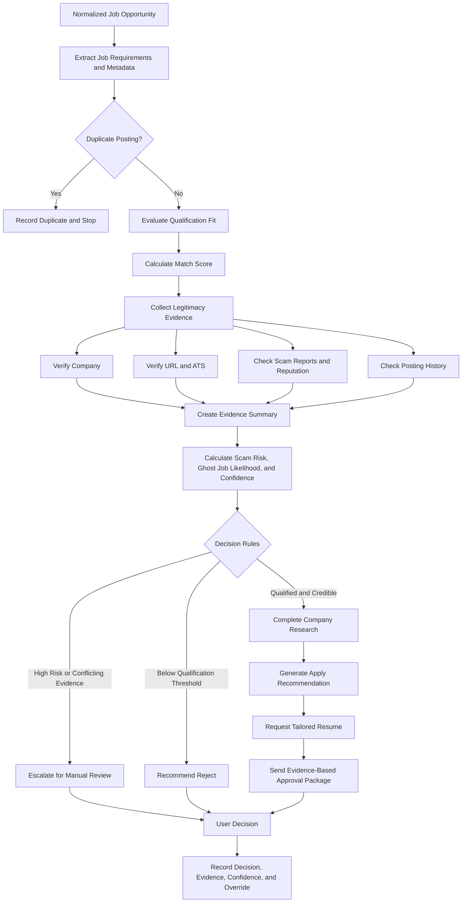
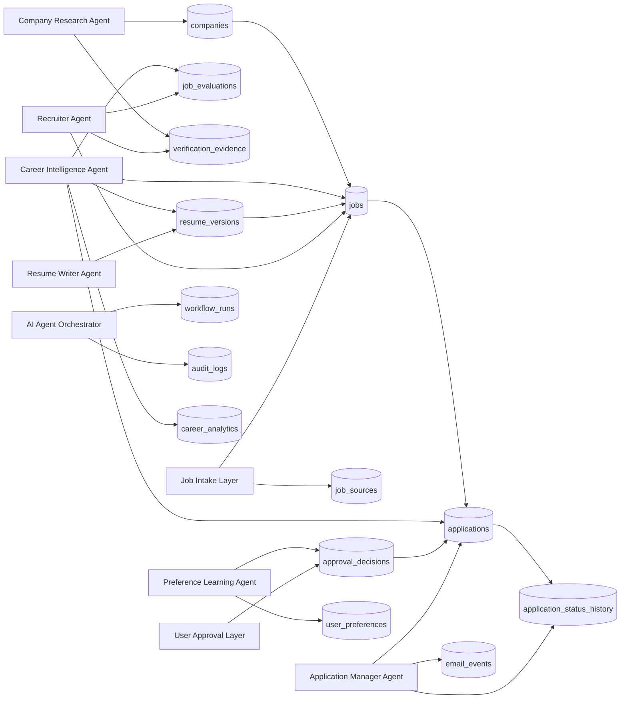

# Jobzy-Agent Architecture

## Overview

Jobzy-Agent is a modular, AI-driven career assistant that automates and enhances the job search process through specialized AI agents. The system is designed around a multi-agent architecture, allowing each agent to focus on a specific business capability while the AI Agent Orchestrator coordinates the overall workflow.

The architecture emphasizes:

- Modular design
- Human approval before irreversible actions
- Extensibility
- Auditability
- Separation of concerns

---

# High-Level Architecture

```text
                    External Systems
─────────────────────────────────────────────────────────────

 Gmail      LinkedIn      Indeed      Company ATSs
   │             │             │              │
   └─────────────┴─────────────┴──────────────┘
                         │
                         ▼
                  AI Agent Orchestrator
                         │
     ┌──────────┬─────────┬─────────┬──────────┬─────────┐
     │          │         │         │          │
Recruiter   Resume    Application  Career   Company
 Agent      Writer      Manager   Intelligence Research
     │          │         │         │          │
     └──────────┴─────────┴─────────┴──────────┘
                         │
                    PostgreSQL
                         │
                 Google Drive (.docx)
                         │
                    User Approval
```

---

# Component Diagram

This diagram shows the primary system components and the responsibilities connecting them.

```mermaid
flowchart LR
    subgraph Sources["Job Opportunity Sources"]
        Gmail["Gmail"]
        Manual["Manual Job Entry"]
        Future["Future Sources"]
    end

    subgraph Workflow["Workflow and Orchestration"]
        Intake["Job Intake Layer"]
        N8N["n8n"]
        Orchestrator["AI Agent Orchestrator"]
    end

    subgraph Agents["Specialized Agents"]
        Recruiter["Recruiter Agent"]
        Research["Company Research Agent"]
        Resume["Resume Writer Agent"]
        Application["Application Manager Agent"]
        Intelligence["Career Intelligence Agent"]
        Preferences["Preference Learning Agent"]
    end

    subgraph Data["Data and Document Services"]
        PostgreSQL[("PostgreSQL")]
        Generator["Python Resume Generator"]
        Drive["Google Drive"]
    end

    subgraph Human["Human Control"]
        Approval["User Approval"]
    end

    Gmail --> Intake
    Manual --> Intake
    Future --> Intake
    Intake --> N8N
    N8N --> Orchestrator

    Orchestrator --> Recruiter
    Orchestrator --> Research
    Orchestrator --> Resume
    Orchestrator --> Application
    Orchestrator --> Intelligence
    Orchestrator --> Preferences

    Recruiter <--> PostgreSQL
    Research <--> PostgreSQL
    Resume <--> PostgreSQL
    Application <--> PostgreSQL
    Intelligence <--> PostgreSQL
    Preferences <--> PostgreSQL

    Resume --> Generator
    Generator --> Drive
    Application --> Approval
    Approval --> PostgreSQL
``
---

# Core Components

## AI Agent Orchestrator

Coordinates every workflow and routes work to specialized agents.

Responsibilities:

- Workflow orchestration
- Error handling
- State management
- Notifications
- Audit logging

---

## Specialized AI Agents

The Orchestrator delegates work to:

- Recruiter Agent
- Resume Writer Agent
- Application Manager Agent
- Career Intelligence Agent
- Company Research Agent
- Preference Learning Agent (Future)

---

## Data Layer

Primary Database

- PostgreSQL

Stores:

- Jobs
- Companies
- Applications
- Resume Versions
- User Preferences
- Analytics
- Workflow History

---

## Document Storage

Google Drive

Stores:

- Master Resume
- Resume Versions
- Cover Letters (Future)

---

## External Integrations

Current

- Gmail
- Google Drive

Future

- LinkedIn
- Indeed
- Workday
- Greenhouse
- Lever
- Ashby
- Browser Automation

---

# End-to-End Workflow

## Step 1

Job alert arrives in Gmail.

↓

## Step 2

The AI Agent Orchestrator creates a new workflow.

↓

## Step 3

Recruiter Agent:

- Reads the job description
- Extracts metadata
- Scores the opportunity
- Detects duplicates

↓

## Step 4

If the opportunity meets the qualification threshold:

Resume Writer Agent generates a tailored resume.

Otherwise:

Archive the opportunity.

↓

## Step 5

Company Research Agent gathers company information.

↓

## Step 6

Application Manager Agent creates an application record.

↓

## Step 7

Approval Package is generated containing:

- Match Score
- Salary
- Resume
- Company Summary
- Recommendation

↓

## Step 8

User chooses:

Approve

or

Reject

↓

## Step 9

Career Intelligence Agent updates metrics.

↓

## Step 10

Preference Learning Agent records the decision.

---
# Job Evaluation Sequence Diagram

This sequence diagram shows the order of communication between the user, workflow platform, agents, storage systems, and database.

```mermaid
sequenceDiagram
    actor User
    participant Source as Job Source
    participant Intake as Job Intake Layer
    participant N8N as n8n
    participant Orchestrator as AI Agent Orchestrator
    participant Recruiter as Recruiter Agent
    participant Research as Company Research Agent
    participant Database as PostgreSQL
    participant Writer as Resume Writer Agent
    participant Generator as Python Resume Generator
    participant Drive as Google Drive

    Source->>Intake: Submit job opportunity
    Intake->>Intake: Validate and normalize input
    Intake->>N8N: Start workflow
    N8N->>Orchestrator: Route normalized job
    Orchestrator->>Recruiter: Request evaluation
    Recruiter->>Database: Check for duplicates
    Recruiter->>Research: Request company verification
    Research->>Database: Store company evidence
    Recruiter->>Database: Store fit and legitimacy assessment

    alt Duplicate, suspicious, or below threshold
        Orchestrator->>User: Request rejection or manual review
        User->>Database: Record decision
    else Qualified and credible
        Orchestrator->>Writer: Request tailored resume
        Writer->>Generator: Generate DOCX
        Generator->>Drive: Store resume
        Writer->>Database: Store resume metadata
        Orchestrator->>User: Send approval package
        User->>Database: Record approval decision
    end
```

---
---

# AI Decision Flow

The AI decision flow shows how Jobzy-Agent evaluates an opportunity while preserving evidence, uncertainty, and human control.



The system must generate decisions from collected evidence rather than generating a conclusion first and justifying it afterward. Low-confidence or conflicting results must be escalated for manual review.

---
# Data Flow

```text
Gmail
   │
   ▼
Recruiter Agent
   │
   ▼
PostgreSQL
   │
   ▼
Resume Writer
   │
   ▼
Google Drive (.docx)
   │
   ▼
Application Manager
   │
   ▼
Career Intelligence
```

---
# Database Interaction Flow

The database interaction flow shows which components create, update, and read Jobzy-Agent records.



PostgreSQL is the system of record. Important history—such as application statuses, approval decisions, agent actions, and resume versions—must be appended or versioned rather than overwritten.

---
---

# Security Principles

- Human approval before submission
- Never fabricate resume experience
- Version every generated resume
- Maintain audit logs
- Preserve historical application data
- Never overwrite the master resume

---

# Design Principles

- Single Responsibility Principle
- Modular architecture
- AI agents are replaceable
- Database-first design
- Configuration over hardcoding
- Human-in-the-loop decision making
- Explainable AI recommendations

---

# Future Architecture

Future releases may include:

- Browser automation
- ATS integrations
- API integrations
- Interview preparation
- Salary negotiation assistant
- Multi-model AI support
- Voice interaction
- Mobile companion application
