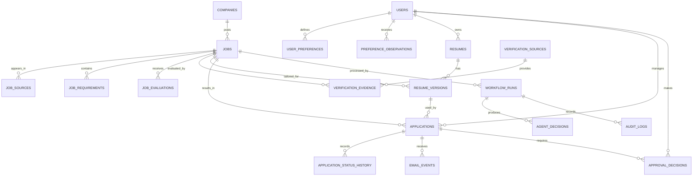

# Jobzy-Agent Data Model

## Purpose

This document defines the conceptual and logical data model for Jobzy-Agent. It describes what information the system stores, how records relate to one another, and which integrity rules the database must enforce.

The physical PostgreSQL implementation will be created separately under `database/schema/` and `database/migrations/`.

## Design Goals

- Preserve a complete history of job opportunities and applications.
- Support both Gmail and manual job intake.
- Prevent duplicate jobs where practical.
- Separate verified facts from AI-generated assessments.
- Preserve every tailored resume version.
- Support manual and email-detected application updates.
- Record evidence behind legitimacy and scam-risk assessments.
- Maintain an audit trail of agent and user decisions.
- Keep explicit preferences separate from inferred preferences.
- Support future career analytics without duplicating derived metrics.

## Modeling Conventions

- Table names use lowercase `snake_case`.
- Primary keys use UUIDs.
- Foreign keys use the referenced entity name followed by `_id`.
- Dates and times use PostgreSQL `timestamptz`.
- Records include `created_at` and `updated_at` where appropriate.
- Historical events are appended rather than overwritten.
- Monetary amounts are stored as integers in the smallest currency unit.
- Currency is stored using a three-letter code such as `USD`.
- Flexible AI output may use `jsonb`, but important searchable fields receive dedicated columns.
- Sensitive data is stored only when required.

## Entity Groups

### User and Preference Data

- `users`
- `user_preferences`
- `preference_observations`

### Job and Company Data

- `companies`
- `job_sources`
- `jobs`
- `job_requirements`

### Evaluation and Verification Data

- `job_evaluations`
- `verification_sources`
- `verification_evidence`

### Resume Data

- `resumes`
- `resume_versions`

### Application Lifecycle Data

- `applications`
- `application_status_history`
- `email_events`
- `approval_decisions`

### Workflow and Audit Data

- `workflow_runs`
- `agent_decisions`
- `audit_logs`

## Scope

The first database implementation will prioritize the tables required to ingest, evaluate, approve, and track a job opportunity. Future tables may support interviews, follow-ups, offers, analytics snapshots, browser-assisted applications, and learned preference models.

---
## Conceptual Entity Relationship Diagram

### Relationship Notation

- `||` means exactly one.
- `o{` means zero or many.
- For example, one company may post zero or many jobs.
- A job may have zero or many evaluations over time.
- An application may accumulate many status-history and email-event records.

---
## Entity Definitions

### `users`

Represents the owner of job-search data. The first release supports one user, but retaining this entity avoids embedding personal identity throughout unrelated tables.

| Field | Purpose | Rules |
|---|---|---|
| `id` | User identifier | Primary key |
| `display_name` | Preferred display name | Required |
| `email` | Notification email | Optional and unique when present |
| `created_at` | Record creation time | Required |
| `updated_at` | Last update time | Required |

### `user_preferences`

Stores preferences explicitly confirmed by the user.

Examples include minimum salary, target titles, work arrangement, location, industry, and qualification threshold.

| Field | Purpose | Rules |
|---|---|---|
| `id` | Preference identifier | Primary key |
| `user_id` | Preference owner | Foreign key to `users` |
| `preference_key` | Stable preference name | Required |
| `preference_value` | Configured value | Required `jsonb` |
| `is_active` | Whether the preference currently applies | Required |
| `created_at` | Record creation time | Required |
| `updated_at` | Last update time | Required |

A user must not have more than one active value for the same `preference_key`.

### `preference_observations`

Stores possible inferred preferences detected from user decisions. Observations do not become explicit preferences without user confirmation.

| Field | Purpose | Rules |
|---|---|---|
| `id` | Observation identifier | Primary key |
| `user_id` | Related user | Foreign key to `users` |
| `job_id` | Job that contributed to the observation | Optional foreign key to `jobs` |
| `approval_decision_id` | Decision that produced the signal | Optional foreign key to `approval_decisions` |
| `observation_key` | Inferred preference category | Required |
| `observed_value` | Possible inferred value | Required `jsonb` |
| `confidence_score` | Confidence from 0 to 100 | Required and range-constrained |
| `review_status` | Proposed, accepted, or rejected | Required |
| `model_version` | Model or rule version that produced it | Required |
| `created_at` | Record creation time | Required |

Accepted observations may be converted into explicit `user_preferences` through a separately audited user action.

---

## Job and Company Entities

### `companies`

Stores one normalized record for each company.

| Field | Purpose | Rules |
|---|---|---|
| `id` | Company identifier | Primary key |
| `display_name` | Company’s public name | Required |
| `normalized_name` | Name used for matching and deduplication | Required and indexed |
| `website_domain` | Official company domain | Optional and unique when verified |
| `careers_url` | Official careers-page URL | Optional |
| `industry` | Company industry | Optional |
| `company_size` | Employee-size category or estimate | Optional |
| `verification_status` | Unverified, verified, conflicting, or rejected | Required |
| `created_at` | Record creation time | Required |
| `updated_at` | Last update time | Required |

Company names from emails or job boards must be normalized before duplicate-company records are created.

### `jobs`

Stores the normalized representation of a job opportunity, regardless of where it was discovered.

| Field | Purpose | Rules |
|---|---|---|
| `id` | Job identifier | Primary key |
| `company_id` | Company posting the job | Foreign key to `companies` |
| `title` | Original job title | Required |
| `normalized_title` | Title used for matching and analytics | Required and indexed |
| `description` | Normalized job description | Required |
| `canonical_url` | Preferred posting URL | Optional |
| `external_posting_id` | Employer or ATS requisition identifier | Optional |
| `location_text` | Location as shown in the posting | Optional |
| `work_arrangement` | Remote, hybrid, on-site, or unspecified | Required |
| `employment_type` | Full-time, part-time, contract, or other | Optional |
| `salary_min_minor` | Minimum compensation in the smallest currency unit | Optional |
| `salary_max_minor` | Maximum compensation in the smallest currency unit | Optional |
| `salary_currency` | Three-letter currency code | Optional when salary is absent; required when salary is present |
| `salary_period` | Hourly, monthly, annual, or other | Optional |
| `posted_at` | Posting date | Optional |
| `closes_at` | Application deadline | Optional |
| `first_seen_at` | First time Jobzy-Agent observed the job | Required |
| `last_seen_at` | Most recent observation | Required |
| `status` | New, active, expired, duplicate, suspicious, archived, or rejected | Required |
| `description_hash` | Hash used to assist duplicate detection | Required and indexed |
| `created_at` | Record creation time | Required |
| `updated_at` | Last update time | Required |

Salary values must not be inferred when the posting does not provide them. Public estimates belong in research or evidence records and must remain distinguishable from employer-stated compensation.

### `job_sources`

Records every place or message from which a job was received. Multiple sources may point to the same normalized job.

| Field | Purpose | Rules |
|---|---|---|
| `id` | Source-record identifier | Primary key |
| `job_id` | Normalized job | Foreign key to `jobs` |
| `source_type` | Gmail, manual paste, URL, LinkedIn, Indeed, ATS, or other | Required |
| `source_reference` | Email message ID, URL, or other source identifier | Required |
| `source_url` | Original posting URL | Optional |
| `received_at` | Time the source entered Jobzy-Agent | Required |
| `raw_content_hash` | Hash used to detect repeated intake | Required |
| `created_at` | Record creation time | Required |

The combination of source type and source reference should be unique when the source provides a stable identifier.

### `job_requirements`

Stores individually extracted job requirements so they can be compared, searched, and analyzed.

| Field | Purpose | Rules |
|---|---|---|
| `id` | Requirement identifier | Primary key |
| `job_id` | Related job | Foreign key to `jobs` |
| `requirement_type` | Skill, experience, education, certification, responsibility, or other | Required |
| `requirement_name` | Normalized requirement name | Required |
| `requirement_text` | Original supporting text | Required |
| `priority` | Required or preferred | Required |
| `minimum_years` | Stated minimum experience | Optional and non-negative |
| `created_at` | Record creation time | Required |

Extracted requirements must preserve the original supporting text so users can audit how the requirement was interpreted.

---

## Evaluation and Verification Entities

### `job_evaluations`

Stores a versioned assessment of qualification fit and posting legitimacy. A job may be evaluated multiple times as resumes, preferences, evidence, prompts, or models change.

| Field | Purpose | Rules |
|---|---|---|
| `id` | Evaluation identifier | Primary key |
| `job_id` | Evaluated job | Foreign key to `jobs` |
| `user_id` | User being matched | Foreign key to `users` |
| `resume_version_id` | Resume version used for comparison | Optional foreign key to `resume_versions` |
| `qualification_score` | Qualification fit from 0 to 100 | Required and range-constrained |
| `legitimacy_score` | Posting legitimacy from 0 to 100 | Required and range-constrained |
| `scam_risk` | Low, medium, or high | Required |
| `ghost_job_likelihood` | Low, medium, or high | Required |
| `confidence_level` | Low, medium, or high | Required |
| `recommendation` | Apply, review, or reject | Required |
| `strengths` | Supported matching qualifications | Required `jsonb` |
| `gaps` | Missing or uncertain qualifications | Required `jsonb` |
| `explanation` | Evidence-based evaluation summary | Required |
| `model_version` | AI model used | Required |
| `prompt_version` | Prompt or evaluation-rule version | Required |
| `evaluated_at` | Evaluation time | Required |
| `created_at` | Record creation time | Required |

Evaluations are immutable historical records. A re-evaluation creates a new row rather than overwriting the prior result.

### `verification_sources`

Stores reusable information about sources consulted during legitimacy verification.

| Field | Purpose | Rules |
|---|---|---|
| `id` | Verification-source identifier | Primary key |
| `source_name` | Human-readable source name | Required |
| `source_type` | Official company, ATS, government registry, search result, review site, or other | Required |
| `base_url` | Primary source URL | Optional |
| `authority_level` | Primary, authoritative third party, secondary, or anonymous | Required |
| `is_active` | Whether the source may currently be used | Required |
| `created_at` | Record creation time | Required |
| `updated_at` | Last update time | Required |

Official company and trusted ATS sources should generally receive greater evidentiary weight than anonymous or unverified sources.

### `verification_evidence`

Stores each observable fact, risk signal, conflict, or unverified item used in a legitimacy assessment.

| Field | Purpose | Rules |
|---|---|---|
| `id` | Evidence identifier | Primary key |
| `job_id` | Related job | Foreign key to `jobs` |
| `job_evaluation_id` | Evaluation using the evidence | Foreign key to `job_evaluations` |
| `verification_source_id` | Source consulted | Foreign key to `verification_sources` |
| `evidence_class` | Verified fact, risk signal, conflicting evidence, or unverified information | Required |
| `evidence_type` | Company, URL, recruiter, compensation, reputation, posting history, or other | Required |
| `summary` | Concise description of the evidence | Required |
| `source_url` | Exact supporting URL | Optional when unavailable |
| `observed_at` | Date associated with the underlying information | Optional |
| `checked_at` | Time Jobzy-Agent checked the source | Required |
| `score_effect` | Signed effect on the legitimacy score | Required and range-constrained |
| `confidence_score` | Evidence confidence from 0 to 100 | Required and range-constrained |
| `created_at` | Record creation time | Required |

A job must not be classified as confirmed fraud from one weak signal. Missing information must be stored as unverified—not as proof of fraud. Conflicting evidence must reduce confidence and may require manual review.

---

## Resume Entities

### `resumes`

Represents a logical resume owned by the user. The master resume is preserved as a distinct source document.

| Field | Purpose | Rules |
|---|---|---|
| `id` | Resume identifier | Primary key |
| `user_id` | Resume owner | Foreign key to `users` |
| `resume_name` | Human-readable name | Required |
| `resume_type` | Master or supporting source | Required |
| `is_active` | Whether the resume may be used for new evaluations | Required |
| `drive_file_id` | Google Drive identifier for the source document | Optional |
| `created_at` | Record creation time | Required |
| `updated_at` | Last update time | Required |

The system must never overwrite a master resume when generating tailored versions.

### `resume_versions`

Stores every generated or manually revised resume version.

| Field | Purpose | Rules |
|---|---|---|
| `id` | Resume-version identifier | Primary key |
| `resume_id` | Source resume | Foreign key to `resumes` |
| `job_id` | Job for which the version was tailored | Optional foreign key to `jobs` |
| `parent_version_id` | Prior version used as a starting point | Optional self-referencing foreign key |
| `version_number` | Sequential version number within the source resume | Required |
| `status` | Draft, approved, rejected, superseded, or used | Required |
| `drive_file_id` | Google Drive file identifier | Optional until the file is created |
| `file_name` | Generated document name | Optional until generated |
| `content_hash` | Integrity and duplicate-detection hash | Required |
| `change_summary` | Summary of changes from the source | Required |
| `model_version` | AI model used to tailor content | Optional for manually created versions |
| `prompt_version` | Tailoring prompt version | Optional for manually created versions |
| `created_at` | Record creation time | Required |

The combination of `resume_id` and `version_number` must be unique.

## Application Lifecycle Entities

### `applications`

Represents a user’s application—or planned application—to a specific job.

| Field | Purpose | Rules |
|---|---|---|
| `id` | Application identifier | Primary key |
| `user_id` | Application owner | Foreign key to `users` |
| `job_id` | Related job | Foreign key to `jobs` |
| `resume_version_id` | Resume version selected for use | Optional foreign key to `resume_versions` |
| `current_status` | Current application state | Required |
| `submission_method` | Manual, browser-assisted, ATS, or other | Optional until submitted |
| `applied_at` | Submission time | Optional |
| `closed_at` | Completion or closure time | Optional |
| `created_at` | Record creation time | Required |
| `updated_at` | Last update time | Required |

`current_status` provides efficient access to the latest state, while the complete history remains in `application_status_history`.

### `application_status_history`

Stores every application-status transition without overwriting prior states.

| Field | Purpose | Rules |
|---|---|---|
| `id` | Status-event identifier | Primary key |
| `application_id` | Related application | Foreign key to `applications` |
| `previous_status` | State before the event | Optional for the first event |
| `new_status` | State after the event | Required |
| `event_source` | Manual, Gmail, agent, ATS, or other | Required |
| `email_event_id` | Supporting email event | Optional foreign key to `email_events` |
| `confidence_score` | Detection confidence from 0 to 100 | Optional for manual updates |
| `notes` | Supporting explanation | Optional |
| `occurred_at` | Time the underlying event occurred | Required |
| `recorded_at` | Time Jobzy-Agent stored the event | Required |

Automated low-confidence or conflicting status changes must be proposed for manual review instead of silently changing `applications.current_status`.

### `email_events`

Stores structured metadata and classifications from relevant application emails.

| Field | Purpose | Rules |
|---|---|---|
| `id` | Email-event identifier | Primary key |
| `application_id` | Related application | Optional foreign key to `applications` until matched |
| `gmail_message_id` | Gmail’s stable message identifier | Required and unique |
| `sender_address` | Sender email address | Required |
| `sender_domain` | Normalized sender domain | Required and indexed |
| `subject` | Email subject | Required |
| `event_type` | Received, recruiter outreach, interview, assessment, offer, rejection, follow-up, or other | Required |
| `confidence_score` | Classification confidence from 0 to 100 | Required and range-constrained |
| `requires_action` | Whether the user needs to respond | Required |
| `received_at` | Gmail receipt time | Required |
| `processed_at` | Classification time | Required |
| `created_at` | Record creation time | Required |

The system should minimize stored email content. Full message bodies should not be retained unless required and explicitly approved.

### `approval_decisions`

Stores user decisions about recommendations, resume drafts, applications, and preference changes.

| Field | Purpose | Rules |
|---|---|---|
| `id` | Decision identifier | Primary key |
| `user_id` | User making the decision | Foreign key to `users` |
| `job_id` | Related job | Optional foreign key to `jobs` |
| `job_evaluation_id` | Related evaluation | Optional foreign key to `job_evaluations` |
| `application_id` | Related application | Optional foreign key to `applications` |
| `resume_version_id` | Related resume version | Optional foreign key to `resume_versions` |
| `decision_type` | Approve, reject, request changes, save for later, or manual review | Required |
| `reason` | Optional user explanation | Optional |
| `decided_at` | Decision time | Required |
| `created_at` | Record creation time | Required |

At least one supported target—job, evaluation, application, or resume version—must be present for each decision.

---

## Workflow and Audit Entities

### `workflow_runs`

Stores the execution state of each automated or manually initiated workflow.

| Field | Purpose | Rules |
|---|---|---|
| `id` | Workflow-run identifier | Primary key |
| `job_id` | Related job | Optional foreign key to `jobs` |
| `workflow_name` | Stable workflow identifier | Required |
| `workflow_version` | Version of the workflow definition | Required |
| `trigger_type` | Gmail, manual, schedule, webhook, retry, or other | Required |
| `trigger_reference` | Message ID, webhook ID, or other triggering identifier | Optional |
| `idempotency_key` | Prevents duplicate processing of the same trigger | Required and unique |
| `status` | Pending, running, succeeded, failed, cancelled, or manual review | Required |
| `started_at` | Workflow start time | Required |
| `completed_at` | Workflow completion time | Optional until finished |
| `error_code` | Stable error category | Optional |
| `error_summary` | Sanitized failure explanation | Optional |
| `created_at` | Record creation time | Required |
| `updated_at` | Last update time | Required |

An idempotency key allows a retry to recognize that the same event was already processed, helping prevent duplicate jobs, emails, or resumes.

### `agent_decisions`

Stores important outputs and recommendations produced by specialized agents.

| Field | Purpose | Rules |
|---|---|---|
| `id` | Agent-decision identifier | Primary key |
| `workflow_run_id` | Workflow producing the decision | Foreign key to `workflow_runs` |
| `agent_name` | Orchestrator, recruiter, resume writer, application manager, or other | Required |
| `action_name` | Stable action performed | Required |
| `related_entity_type` | Job, evaluation, resume, application, or other | Required |
| `related_entity_id` | Identifier of the related record | Required |
| `decision` | Structured decision or result | Required `jsonb` |
| `explanation` | Human-readable explanation | Required |
| `confidence_score` | Confidence from 0 to 100 | Optional and range-constrained |
| `model_version` | AI model used | Optional for deterministic actions |
| `prompt_version` | Prompt version used | Optional for deterministic actions |
| `created_at` | Decision time | Required |

Agent decisions must reference stored inputs and evidence where applicable. Explanations must not expose hidden reasoning or secrets.

### `audit_logs`

Stores an immutable record of security-sensitive and business-significant actions.

| Field | Purpose | Rules |
|---|---|---|
| `id` | Audit-event identifier | Primary key |
| `workflow_run_id` | Related workflow | Optional foreign key to `workflow_runs` |
| `actor_type` | User, agent, workflow, or system | Required |
| `actor_reference` | User ID, agent name, or system identifier | Required |
| `action` | Stable action name | Required |
| `entity_type` | Type of record affected | Required |
| `entity_id` | Identifier of the affected record | Required |
| `metadata` | Sanitized contextual details | Required `jsonb` |
| `occurred_at` | Event time | Required |

Audit records are append-only. They must not contain passwords, access tokens, full email bodies, or unnecessary personal data.

---

## Relationship and Referential Rules

- A company may exist without a job, but every job must reference one company.
- A job may have many source records, requirements, evaluations, evidence records, resume versions, applications, and workflow runs.
- An evaluation must reference the user and job it evaluates.
- Verification evidence must reference both its evaluation and its consulted source.
- A resume version must reference one source resume.
- An application must reference one user and one job.
- Status history must reference one application.
- Agent decisions must reference one workflow run.
- Historical records should normally restrict parent deletion rather than disappear through cascading deletion.
- Hard deletion should be reserved for test data, legal requirements, or explicitly approved maintenance.
- Archived or inactive states should be used for most business records.

## Required Constraints

PostgreSQL must enforce the following rules:

- Scores and confidence values must remain between 0 and 100.
- `salary_min_minor` must not exceed `salary_max_minor`.
- Salary amounts must be non-negative.
- `last_seen_at` must not precede `first_seen_at`.
- `completed_at` must not precede `started_at`.
- `closed_at` must not precede `applied_at`.
- Version numbers must be positive.
- Required status and category fields must use controlled values.
- A resume version number must be unique within its source resume.
- Gmail message IDs must be unique.
- Workflow idempotency keys must be unique.
- Stable source references must be unique within their source type when available.
- Approval decisions must reference at least one supported target.
- Explicit and inferred preferences must remain distinguishable.
- AI explanations must not substitute for structured scores, statuses, or evidence.

## Duplicate Detection Strategy

Duplicate detection uses multiple signals rather than one field alone:

1. Stable external requisition or ATS identifier.
2. Canonical posting URL.
3. Company plus normalized title.
4. Description hash.
5. Location and employment type.
6. Posting and observation dates.

Strong duplicate matches should connect additional `job_sources` to an existing `jobs` record rather than creating another normalized job.

Ambiguous matches must be flagged for review instead of merged automatically.

## Indexing Strategy

Indexes should support frequent filtering, joins, deduplication, and timeline queries.

Planned indexes include:

- `companies(normalized_name)`
- `companies(website_domain)`
- `jobs(company_id)`
- `jobs(normalized_title)`
- `jobs(status, first_seen_at)`
- `jobs(description_hash)`
- `jobs(external_posting_id)` when present
- `job_sources(job_id)`
- Unique `job_sources(source_type, source_reference)` when stable
- `job_requirements(job_id, priority)`
- `job_evaluations(job_id, evaluated_at)`
- `job_evaluations(user_id, qualification_score)`
- `verification_evidence(job_evaluation_id)`
- `verification_evidence(job_id, evidence_class)`
- Unique `resume_versions(resume_id, version_number)`
- `resume_versions(job_id)`
- `applications(user_id, current_status)`
- `applications(job_id)`
- `application_status_history(application_id, occurred_at)`
- Unique `email_events(gmail_message_id)`
- `email_events(sender_domain, received_at)`
- `approval_decisions(user_id, decided_at)`
- Unique `workflow_runs(idempotency_key)`
- `workflow_runs(status, started_at)`
- `agent_decisions(workflow_run_id)`
- `audit_logs(entity_type, entity_id, occurred_at)`

Indexes will be validated against real query patterns. Unused or redundant indexes should not be retained because every index adds storage and write overhead.

## Historical Integrity

The following records are append-only or versioned:

- Job evaluations
- Verification evidence
- Resume versions
- Application status history
- Approval decisions
- Preference observations
- Agent decisions
- Audit logs

Corrections should create a new record or an auditable correction event. Historical evidence and decisions must not be silently rewritten.

## Privacy and Data Retention

- Store only data required for job-search functionality.
- Do not store Gmail passwords, OAuth tokens, API keys, or database passwords in business tables.
- Minimize retention of full email bodies.
- Store external file identifiers instead of duplicating documents in PostgreSQL.
- Provide a future process for exporting and deleting personal data.
- Ensure logs and errors are sanitized.
- Keep test data clearly separated from personal production data.
- Document future retention periods before automated deletion is introduced.

## Derived Analytics

Career metrics should initially be calculated from source records through SQL queries or database views.

Examples include:

- Application-to-interview rate
- Interview-to-offer rate
- Average recruiter response time
- Resume-version performance
- Success rate by job title
- Success rate by industry
- Salary trends
- Rejection patterns

Derived metrics should not be stored as authoritative facts unless performance requirements later justify materialized views or analytics snapshots.

## Schema Evolution

Database changes will be managed through ordered, version-controlled migrations.

Planned evolution includes:

### Initial Implementation

- Users and explicit preferences
- Companies and jobs
- Job sources and requirements
- Evaluations and verification evidence
- Resumes and resume versions
- Applications and status history
- Approval decisions
- Workflow and audit records

### Later Releases

- Interview events and participants
- Follow-up reminders
- Offers and compensation comparisons
- Browser-assisted application attempts
- Learned preference models
- Analytics snapshots and dashboards
- Additional job-source integrations
- Data-retention automation
- Multi-user support

Every schema change must include its purpose, forward migration, validation, and recovery or rollback approach.

---

## Preference Model

### Preference Categories

Jobzy-Agent supports explicit preferences in the following categories:

| Preference key | Example value type |
|---|---|
| `salary.minimum` | Integer amount and currency |
| `salary.target_range` | Minimum and maximum amounts |
| `job_titles.preferred` | List of titles |
| `job_titles.excluded` | List of titles |
| `qualification.minimum_score` | Number from 0 to 100 |
| `work_arrangements.preferred` | List of remote, hybrid, or on-site values |
| `locations.preferred` | List of locations |
| `employment_types.allowed` | List of employment types |
| `industries.preferred` | List of industries |
| `companies.excluded` | List of company identifiers |
| `company_sizes.preferred` | List of size categories |
| `travel.maximum_percentage` | Number from 0 to 100 |
| `visa.sponsorship_required` | Boolean |
| `risk.maximum_scam_level` | Low, medium, or high |
| `notifications.channels` | List of enabled channels |

### Preference Precedence

When preferences conflict, Jobzy-Agent applies them in this order:

1. A current, explicit user instruction for the active workflow.
2. An active, explicitly confirmed `user_preferences` record.
3. A user-approved inferred preference.
4. An unconfirmed preference observation, used only as supporting context.
5. A system default.

Unconfirmed observations must never override explicit preferences.

### Preference History

Changes to explicit preferences must be auditable. The implementation should preserve:

- Prior value
- New value
- Change source
- User approval
- Change timestamp
- Related observation, when applicable

The initial implementation may use audit events for preference history. A dedicated preference-history table may be added later if query volume or reporting needs justify it.

### Private Preference Setup

Actual personal preference values are runtime data and must not be committed to the repository.

A safe example configuration may be version-controlled, but real values will be entered privately and stored in PostgreSQL after the preference tables are created.